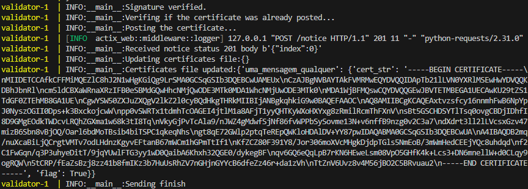

# Trabalho Prático Segurança em Computação

Este trabalho foi desenvolvido utilizando Python para o back-end da Cartesi e JavaScript para o front-end. Além disso, foram empregados scripts em Shell para facilitar o tratamento e envio dos dados, tornando o processo mais simples e automatizado.


## Requisitos

1. **Cartesi**: É necessário instalar o Cartesi para o funcionamento do projeto. Siga o tutorial disponível em [Cartesi Rollups Installation](https://docs.cartesi.io/cartesi-rollups/1.3/development/installation/) para a instalação.

2. **OpenSSL**: Você precisará do OpenSSL para gerar e assinar certificados. Caso não tenha utilize o seguinte comando:

    ```bash
    sudo apt install openssl
    ```
3. **jq**: O shell script irá precisar para concatenar os arquivos de entrada em formato json. Caso não tenha utilize o seguinte comando:
    
    ```bash
    sudo apt install jq
    ```

## Preparando o ambiente

1. **Geração da Chave Privada**: Coloque sua chave privada `private.key` dentro do diretório `/PK`.

   Para gerar a chave privada, utilize o seguinte comando OpenSSL:

    ```bash
    openssl genpkey -algorithm RSA -out ./PK/private.key
    ```

2. **Mensagem para Assinatura**: Coloque uma mensagem sem espaços no arquivo localizado em `/INPUT/message.txt`. Exemplo de mensagem:

    ```
    uma_mensagem_qualquer
    ```

### Scripts

1. **Geração e Assinatura do Certificado**:
   
   Execute o script `certificate_gen.sh` para gerar e assinar o certificado. Este script utiliza a chave privada para criar e assinar o certificado.

    ```bash
    ./certificate_gen.sh
    ```

2. **Geração da Mensagem Assinada**:
   
   Execute o script `signature_gen.sh` para gerar a assinatura necessária para verificação dentro da dApp.

    ```bash
    ./signature_gen.sh
    ```

## Execução e Teste

1. **Construção e Execução**:
   
   Navegue até o diretório `/backend` e execute os seguintes comandos para construir e iniciar o Cartesi:

    ```bash
    cd /backend
    cartesi build
    cartesi run
    ```
    - OBS.: Essa parte pode demorar um pouco, ou até dar alguns erros dependendo da sua CPU, tenha paciência e repita os comandos. Tente fechar e abrir sua IDE e/ou terminais novamente.
2. **Teste**:
   
   Quando o Cartesi estiver rodando abra um novo terminal e execute o script `send_generic.sh` para testar o sistema.

    ```bash
    ./send_generic.sh
    ```
    Utilize a opção 1 para postar o certificad e a opção 2 para revogar o certificado.

3. **Observe a movimentação da dApp pelo LOG do cartesi**

    Se tudo der certo você verá uma saida no terminal parecida com essa aqui:

    

4. **Utilize o inspect através do frontend**: Para fazer isso, rode o `app.js` encontrado dentro do diretório `/front-end` através do seguinte comando:

    ```bash
    node ./front-end/app.js
    ```

## Inputs tratados


1. **Reenviar o mesmo certificado, com a mesma mensagem e assinatura**: Você irá vê na tela de log a mensagem `The certificate was already posted.`, informando que o certificado que o certificado ja foi postado.

2. **Enviar um certificado revogado, com a mesma mensagem e assinatura**: Você verá a mesma mensagem explicada no 1.

3. **E claro, o mais importante, a verificação da assinatura**: Para testar a falha de verificação, você deve acessar o arquivo `send_generic.sh` e descomentar a linha `5` e comentar a linha `4`. A partir disso é so executar o script `send_generic.sh` novamente, passando o 1 como parâmetro.

## Link do vídeo

https://drive.google.com/file/d/10pOpFLrWHcnANOSRPVpoHsDK8cdvK2BX/view?usp=sharing